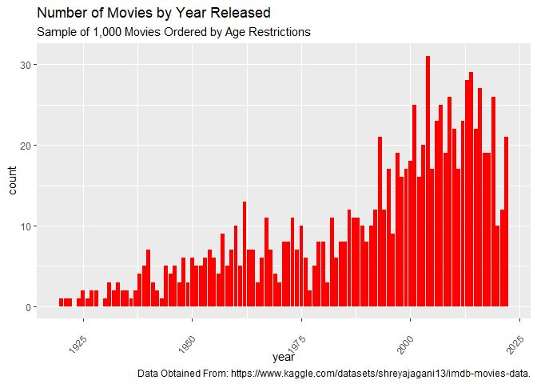
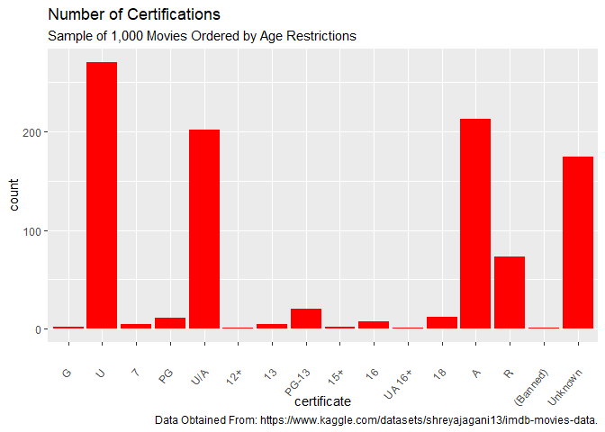
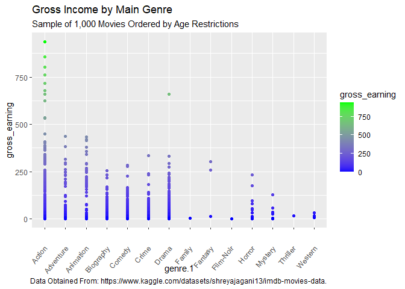
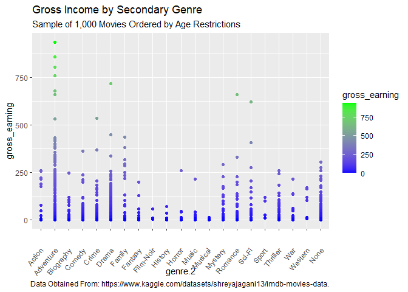
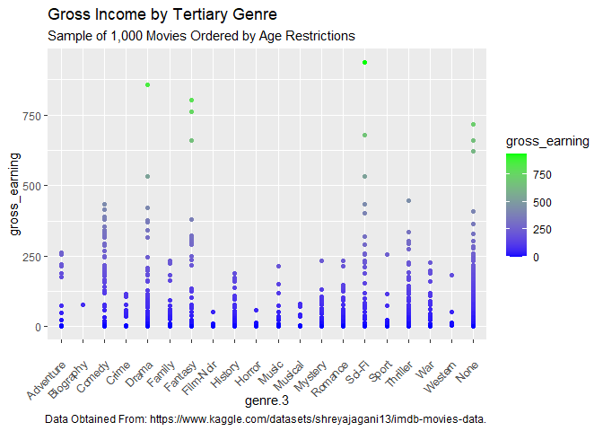
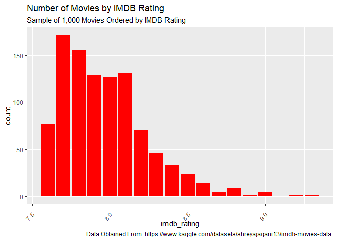
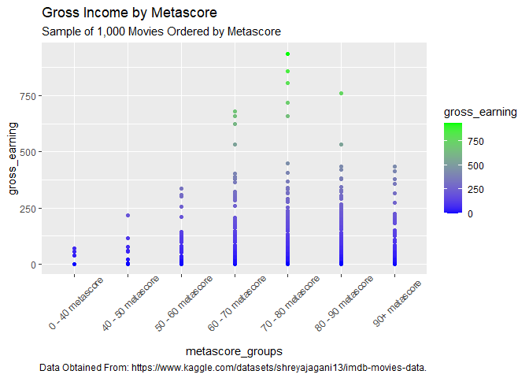
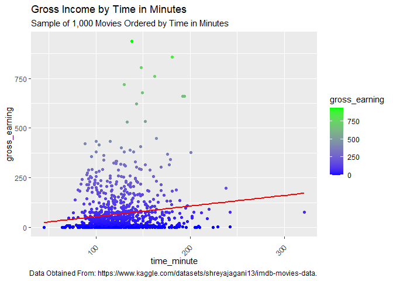
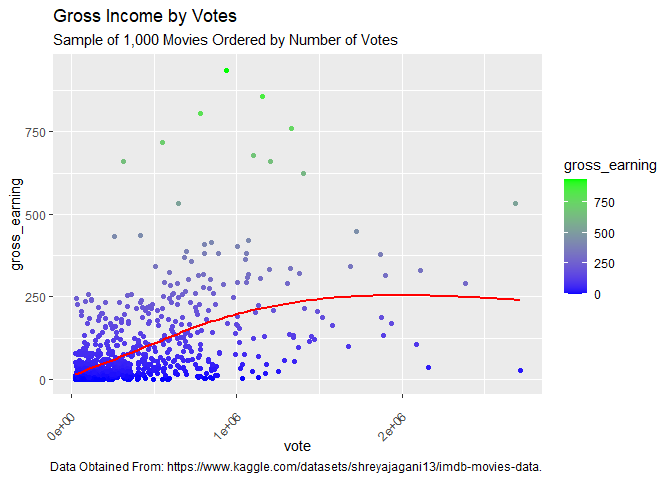

# Exploratory Data Analysis on the top 1,000 Movies According to IMDB
## Project Overview
This project is an exploratory data analysis on the top 1,000 movies according to IMDB to provide business recommendations to maximize gross earnings. I used R to clean and analyze the data, using libraries such as Tidyverse and Ggplot2. I successfully identified the movie features that resulted in the highest gross earnings. These findings are detailed in the Results and Business Recommendations section.

## Dataset Description
The raw data was obtained from this [IMDB Kaggle dataset](https://www.kaggle.com/datasets/shreyajagani13/imdb-movies-data). The dataset contains information on the top 1,000 movies according to IMDB. This dataset includes the:

* Movie title
* Year of Release
* Certificate Rating (AKA Content Rating)
* Genres (Main, Secondary, and Tertiary)
* IMDB Rating
* Metascore Rating 
* Movie Runtime
* Number of Votes
* Gross Earnings 

## Exploratory Data Analysis
The exploratory data analysis was performed using R libraries such as Tidyverse and Ggplot2. The analysis involved exploring the distribution of movies released per year, movie genres, runtime, ratings, and number of votes on IMDB. The analysis also involved identifying any correlation between these variables and providing recommendations to maximize gross earnings.

## Results and Business Recommendations
According to the findings, my recommendations for movie business strategy is the following:

* **Release Year:** 
  * Newer movies tend to earn more on average, and the popularity of movies is increasing. It would be wise to make a movie sooner rather than later to capture this growth and capitalize on future audience growth. 
  

 
* **Certification:** 
  * Create movies with the certification of "U", "U/A", or "A" as these, although competitive, make the most on average. There are also a lot of movies available in these categories to use as reference.
  

 
* **Main Genre:**
  * There are three potential strategies for choosing the main genre of the movie:
    *  Make movie a "Fantasy" as it is highest earning on average with low competitiveness, but data may be skewed due to small amount of observations.
    * Make movie an "Action" as it is highest earning on average with a lot of data to support it, but is a very competitive market.
    * Make movie an "Animation" or "Adventure" as these are high earning, moderate competition, and has a lot of data to support it.
  

 
* **Secondary Genre:** 
  * If the goal is securing market share, I would suggest the secondary genre be either "Action", "Family", or "Sci-Fi" as there is far less competition with high earnings. 
  * If the goal is maximizing gross earnings, I would suggest choosing adventure. 
  * Ensure that the secondary genre complements the main genre.

* **Tertiary Genre:** 
  * Make the third genre either "Adventure", "Comedy", "Fantasy", or "Sci-Fi". All these genres are significantly higher than the others while maintaining nearly the same level of market competition. Keeping all 4 as options also gives flexibility to ensure the genre works with the main and secondary genres. 

* **IMDB Rating:** 
  * Maintain a minimum target of 7.7 on IMDB to match competitors. Ratings could potentially be higher for increased earnings, but this may also result in higher production costs. 

* **Metascore:** 
  * Target a metascore between 60 and 70 as this range yielded the highest average earnings. Metascores higher and lower than this range showed lower earnings on average. 
  

* **Movie Run Time:** 
  * Make the movie between 2 and 3 hours long as the average earnings are highest and there is moderate competition. 

* **Votes:** 
  * Aim for the highest amount of votes feasible given the budget constraints. Higher votes correlated with higher gross earnings. 

## Limitations and Future Works
There are a few limitations to this analysis:

First, I only did an EDA of the variables individually. I believe some variables could be analyzed together to find different trends that may provide useful insights that were not found in this project. For example, color-coding the data by genre instead of gross earnings could provide insight into which types of movies were most popular in a given year. Going further, you could potentially use regression models to better understand the correlations between variables. 

Another limitation is that there were many data points that were low in observations. Some movies with low counts could have skewed the results, showing much higher gross earnings. An example of this would be fantasy in the main genre, which only had 4 observations. While efforts were made to account for this, some bias due to limited data cannot be entirely ruled out.

## Conclusion
This project demonstrates how exploratory data analysis can be used to provide business recommendations to maximize gross earnings in the movie industry. By analyzing the top 1,000 movies on IMDB, key factors contributing to success in the industry were identified, enabling us to provide strategic recommendations for businesses seeking to maximize gross earnings.
